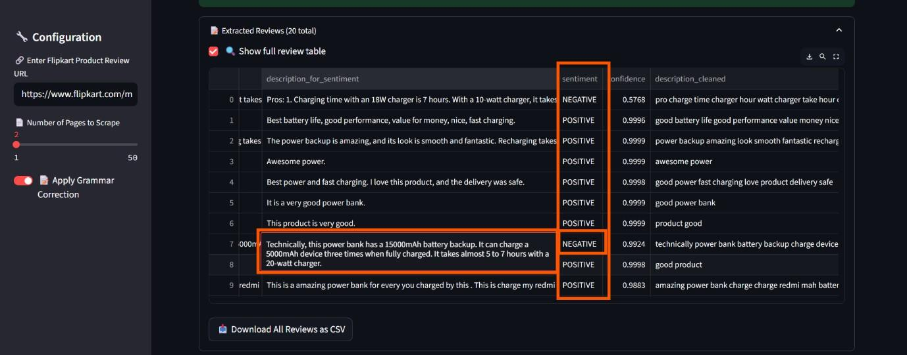

#  Flipkart Product Review Analyzer — Technical Report

> AI-powered sentiment & topic analysis for Flipkart product reviews. Built with Python, NLP, and Gemini AI.

##  Objective

Automatically extract and summarize customer sentiments, themes, and actionable insights from Flipkart product reviews — helping businesses improve products, target marketing, and understand user feedback at scale.

##  Methodology

- **Scraping**: Selenium + BeautifulSoup (anti-bot evasion)
- **NLP**: spaCy, emoji removal, grammar correction (Gemini)
- **Sentiment**: Hugging Face DistilBERT
- **Topic Modeling**: Gensim LDA
- **Insights**: Gemini AI summary
- **UI**: Streamlit

##  Live Demo

[https://jairammargam.streamlit.app](https://jairammargam.streamlit.app)

##  Report Screenshots

### 1. App Landing Page

### 2. Sample Raw Reviews

### 3. Sentiment Distribution

### 4. LDA Topic Modeling

### 5. Frequent Phrases (Bigrams/Trigrams)

### 6. Gemini AI Business Summary

##  Key Business Takeaways

- Gain instant visibility into product issues or praise without manual review reading.
- Identify emerging patterns or complaints early through topic modeling.
- Equip product and marketing teams with actionable insights.

##  Future Enhancements

- Add sentiment-over-time tracking
- Compare multiple products/brands
- Automate email report delivery
- Add word clouds for better visual understanding

##  Conclusion

This tool empowers Flipkart and product vendors to understand the **voice of the customer at scale**, transforming unstructured reviews into **clear, actionable intelligence** using cutting-edge NLP and Generative AI.

##  GitHub Repository

[https://github.com/jairammargam/flipkart-review-analyzer](https://github.com/jairammargam/flipkart-review-analyzer)

##  Prepared By

Jai Ram Margam | Data Scientist & AI Developer
